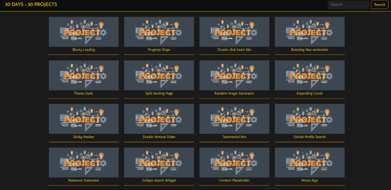

# 30 Days - 30 Projects

To explore the projects, visit the portfolio [here](https://xdharmendra.github.io/30days-30projects/). Click on any project card to view its live demo.



## Description

The **"30 Days - 30 Projects"** portfolio showcases a diverse collection of web development projects, each designed and implemented within a span of 30 days. This project series covers a wide range of web development concepts, from interactive UI components to dynamic animations, aimed at sharpening front-end development skills.

Each project is presented as a card in a grid layout, making it easy to navigate and explore. The portfolio includes various mini-projects such as:

## Projects

| Column 1                            | Column 2                                |
| ----------------------------------- | --------------------------------------- |
| 1. Blurry Loading Animation         | 16. Drink Water                         |
| 2. Progress Steps                   | 17. Movie App                           |
| 3. Double Click Heart Like          | 18. Background Slider                   |
| 4. Rotating Navigation Animation    | 19. Theme Clock                         |
| 5. Hidden Search Widget             | 20. Button Ripple Effect                |
| 6. Scroll Animation                 | 21. Drag N Drop                         |
| 7. Split Landing Page               | 22. Drawing App                         |
| 8. Form Wave Animation              | 23. Kinetic Loader                      |
| 9. Sound Board                      | 24. Content Placeholder                 |
| 10. Dad Jokes                       | 25. Sticky Navbar                       |
| 11. Event Keycodes                  | 26. Double Vertical Slider              |
| 12. FAQ Collapse                    | 27. Toast Notification                  |
| 13. Random Choice Picker            | 28. GitHub Profiles                     |
| 14. Animated Navigation             | 29. Double Click Heart Like (Duplicate) |
| 15. Incrementing Counter            | 30. Password Strength Background        |

## Features

- **Responsive Design:** Built using Bootstrap, ensuring that the layout adjusts smoothly across different screen sizes.
- **Interactive Elements:** Each project focuses on a specific web development technique or feature, enhancing interactivity and user engagement.
- **Search Functionality:** Includes a search bar for quick access to specific projects within the portfolio.
- **Card-Based Layout:** Projects are organized in a card format with preview images and titles, offering a clean and organized browsing experience.
- **Diverse Projects:** Ranges from simple animations and UI components to more complex web applications like a Random Image Generator and a Password Strength Background.

This portfolio not only serves as a personal record of progress but also as a demonstration of growing proficiency in web development over a structured period.

## Installation

If you'd like to run the projects locally:

1. Clone the repository:
   ```bash
   git clone https://github.com/xDharmendra/E-commerce-Website.git

